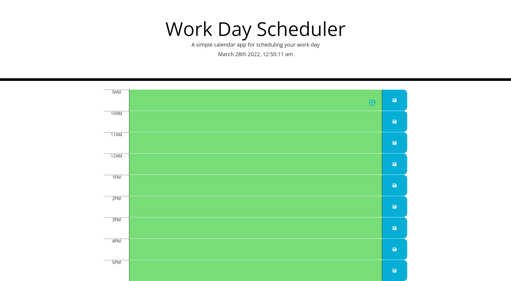

# Work Day Scheduler
 ## Summary

This is a calender application that a user can use to keep track of of their work day using a text area and a save button. One of the nifty features of the application is how the time blocks are color coded in relation to the current time, if the time block is in the past the color will be grey'd out, if present it'll be red and if it's in the future it'll be green. Also any event you save into the time block will be kept if you close or refresh the application.
 ## Technologies
* HTML - 54.5%
* CSS - 16.5%
* JavaScript - 29.0%
 ## Code Breakdown

This application uses multiple APIs (Moment.js, JQuery, BootStrap, CloudFlare, Font Awesome, and Fonts.GoogleAPIs). The time blocks are made
using a div with another div, textarea and button element nestled inside of it. For the JS I used a setInterval() to make the clock and date at the top of the page work. then I used the timeBlock() to set the var currentHour which is in turn compared to the var selectHour in if and else if statements. The "$(".saveBtn").on("click", function()" saves the value and id of each time block and saves it to the users "localStorage" which is then pulled back to the time blocks using JQuery.
## Active Page

https://khyan22.github.io/work-day-schedular/
## Page Screenshot

